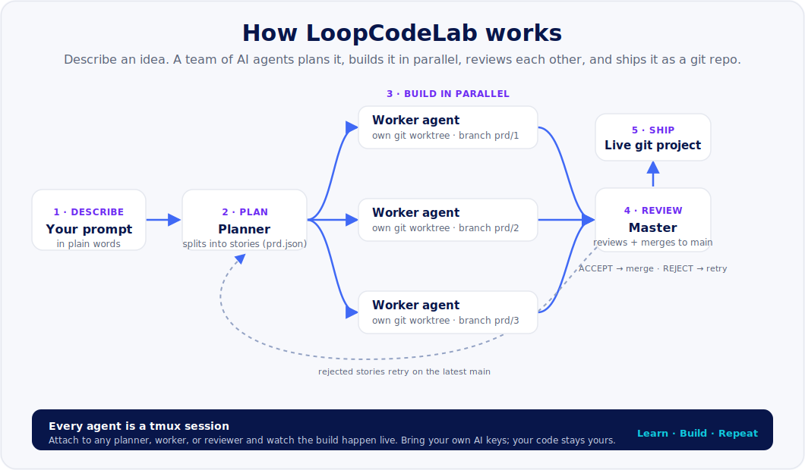

<div align="center">


# LoopCodeLab

### Anyone Can Code. Everyone Can Build.

**A self-hosted web terminal over a tmux PTY bridge, plus Ralph, an autonomous multi-agent build orchestrator that turns a plain-language prompt into a finished, git-tracked project.**

Learn. Build. Repeat.

**[loopcodelab.com](https://loopcodelab.com)** · **[Author](https://tayyabcheema.com)** · **[LinkedIn](https://www.linkedin.com/in/tayyabcheema777/)**

</div>

---

## What is this?

LoopCodeLab is two things working together:

1. **A web terminal.** A dashboard with a real [xterm.js](https://xtermjs.org/) terminal wired to a [tmux](https://github.com/tmux/tmux) PTY bridge, so your sessions live on the server and survive reconnects. You put TLS and auth in front (for example with nginx); the app itself listens only on localhost.

2. **Ralph, the build orchestrator.** You describe what you want in plain words. A **planner** splits the idea into stories, **worker agents build them in parallel** on isolated git worktrees, a **master agent reviews** each branch and merges it, and the whole thing ships as a git repository. Every agent runs in its own tmux session, so you can watch the work happen live.

Describe an idea, and a team of agents plans, builds, reviews, and ships it. Self-host it, bring your own AI keys, and own every line of what it makes.

## Why it is interesting

- **Parallel agents, real git.** Each story is built on its own `git worktree` + branch, reviewed, then merged into `main`. Failures are bounded and retried, not left hanging.
- **Bring your own keys.** Builds run on AI provider credentials you supply (Claude, OpenAI, Qwen, and more). Your keys and your code stay on your machine.
- **Watch it work.** Every planner, worker, and reviewer is a tmux session you can attach to. Nothing is a black box.
- **Multiple CLI agents.** Ralph drives several coding CLIs (`claude`, `codex`, `qwen`, and others) behind one interface, so you can mix and match.
- **The Loop.** Plan → build → review → ship, then learn from the result and go again.

## Learning and self-improvement

LoopCodeLab treats every build as something to learn from, so the platform tunes itself to you over time. This is the Loop System — Learn, Build, Repeat — and it runs on four systems:

- **Cross-project preference memory.** Every start, swap, and finished run records a signal; these are distilled (recency-weighted) into a short profile of your consistent preferences that seeds your next build's defaults and is handed to the planner. A choice is only promoted to a "confirmed" fact once it recurs across separate builds, so a one-off never becomes a rule.
- **Task-aware agent routing.** The planner picks an agent per story from reliability, cost, and availability, adjusted by what it has learned from your own history. Agents that keep stalling or getting rejected on your work get routed around, and a mid-build swap feeds the same memory.
- **A self-curated skill library.** After each build finalizes, a reflector distills a few reusable `SKILL.md` files from that build's logbook and outcome. It is suggest-first: nothing injects into a future build until you approve it, and a scheduled curator retires stale skills and merges near-duplicates.
- **The `MASTER.md` logbook.** The supervising master records its rulings per build; later supervision reads the log instead of re-deriving, and new workers inherit the standing rulings, so a long run stays consistent with itself.

All of it is suggest-only: memory sets smarter defaults, but the confirm step always shows so you can override anything. Because you bring your own keys and self-host, the memory the platform builds about your work stays on your machine.

## How it works

<div align="center">

</div>

## Quick start

**Prerequisites:** Linux, [Node.js](https://nodejs.org/) 20+, `tmux`, `git`, and the AI CLI(s) you want Ralph to drive (for example `claude` or `codex`) installed and on your `PATH`.

```bash
git clone https://github.com/MuhammadTayyabIlyas/loopcodelab.git
cd loopcodelab
npm install

# build the web UI (served at /)
cd web && npm install && npm run build && cd ..

# run (localhost only; put nginx with TLS + auth in front for real use)
npm start
```

The server listens on `http://127.0.0.1:8090`. Open it behind your nginx or via an SSH tunnel.

### Bring your own keys

Ralph needs at least one AI provider credential. Configure them in the Settings page of the UI, or place a `secrets.json` in the data directory (`~/.webtmux/` by default, override with `WEBTMUX_DATA`). Keys never leave your machine.

### No-spend dry run

Set `RALPH_FORCE_TOOL=stub` to drive the whole orchestrator end-to-end with deterministic stubs and no API cost, so you can see the flow before spending anything.

## Project layout

| Path | What it is |
|---|---|
| `server.js` | Entry point and assembly (the app is `~100` lines of wiring). |
| `server/` | Backend modules: tmux/git bridges, the **Ralph orchestrator** (`ralph-engine.mjs`), agents, planner, previews, WebSocket PTY bridge. |
| `ralph/` | The vendored agent loop, prompts, and pure helper modules the orchestrator runs in tmux. |
| `public/` | The terminal dashboard PWA (xterm client + service worker). |
| `web/` | The React product UI, built to `web/dist`. |
| `saas/` | Auth and session helpers. |

## Credits

- **Created by [Muhammad Tayyab Ilyas](https://tayyabcheema.com)** — [tayyabcheema777@gmail.com](mailto:tayyabcheema777@gmail.com) · [LinkedIn](https://www.linkedin.com/in/tayyabcheema777/) · [tayyabcheema.com](https://tayyabcheema.com)
- **Website:** [loopcodelab.com](https://loopcodelab.com)

## Support the developer

LoopCodeLab is free to use with your own AI keys, and it is built and maintained by one developer. There are no plans and no metering — if it saves you time, you can drop a tip in the jar and buy the developer a coffee. Every bit helps keep the loop going.

<div align="center">

</div>

**Scan the PayPal Tip Jar** above to say thanks, or reach the author at [tayyabcheema.com](https://tayyabcheema.com). Thank you for supporting independent software.

## License

Licensed under **[Creative Commons Attribution-NonCommercial 4.0 International (CC BY-NC 4.0)](LICENSE)**.

You may use, self-host, share, and adapt this project for **non-commercial** purposes with attribution to the author. **Commercial use is not permitted** without written permission — contact [tayyabcheema777@gmail.com](mailto:tayyabcheema777@gmail.com).

---

<div align="center">

Learn. Build. Repeat.

**[loopcodelab.com](https://loopcodelab.com)**

</div>
